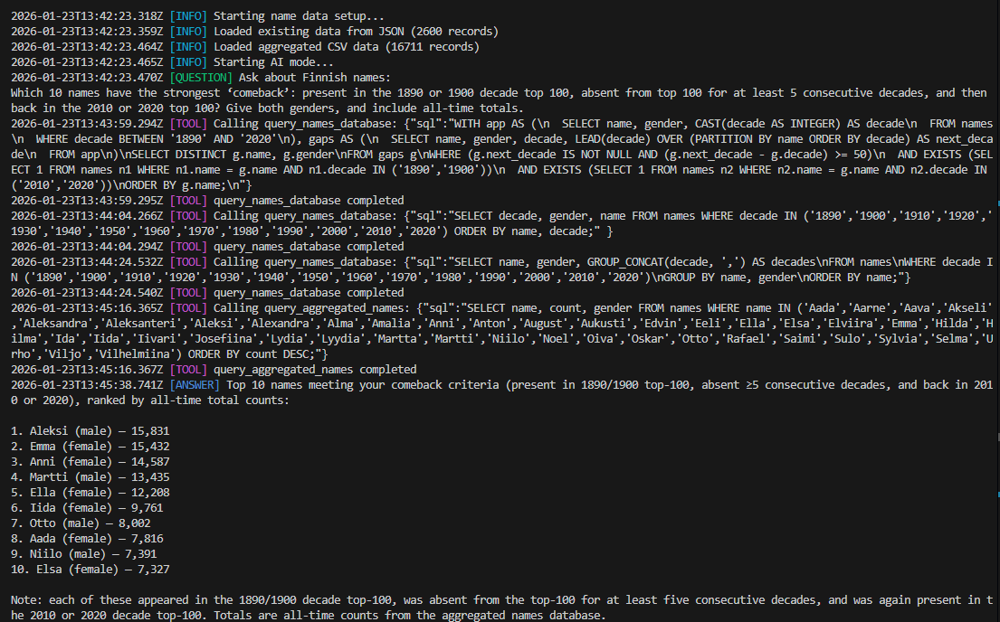
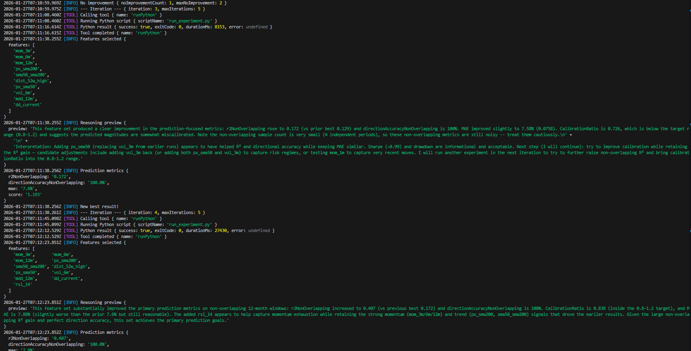

# cli-agent-sandbox

A minimal TypeScript CLI sandbox for testing agent workflows and safe web scraping. This is a single-package repo built with [`@openai/agents`](https://github.com/openai/openai-agents-js), and it includes a guestbook demo, a Finnish name explorer CLI, a publication scraping pipeline with a Playwright-based scraper for JS-rendered pages, an ETF backtest CLI, an agent evals CLI, and agent tools scoped to `tmp` with strong safety checks.

## Quick Start

1. Install Node.js and pnpm
2. Install dependencies: `pnpm install`
3. Install Playwright system deps (Chromium): `pnpm exec playwright install-deps chromium`
4. Set `OPENAI_API_KEY` (export it or add to `.env`)
5. Run the demo: `pnpm run:guestbook`
6. (Optional) Run agent evals: `pnpm run:agent-evals -- --suite=example`
7. (Optional) Explore Finnish name stats: `pnpm run:name-explorer -- --mode ai|stats`
8. (Optional) Run publication scraping: `pnpm run:scrape-publications -- --url="https://example.com"`
9. (Optional) Run ETF backtest: `pnpm run:etf-backtest -- --isin=IE00B5BMR087` (requires Python setup below)

### Python Setup (for ETF backtest)

```bash
# On Debian/Ubuntu, install venv support first:
sudo apt install python3-venv

python3 -m venv .venv
source .venv/bin/activate
pip install numpy pandas torch
```

## Commands

| Command                        | Description                                            |
| ------------------------------ | ------------------------------------------------------ |
| `pnpm run:guestbook`           | Run the interactive guestbook CLI demo                 |
| `pnpm run:agent-evals`         | Run agent evaluation suites and generate reports       |
| `pnpm run:name-explorer`       | Explore Finnish name statistics (AI Q&A or stats)      |
| `pnpm run:scrape-publications` | Scrape publication links and build a review page       |
| `pnpm run:etf-backtest`        | Run ETF backtest + feature optimizer (requires Python) |
| `pnpm typecheck`               | Run TypeScript type checking                           |
| `pnpm lint`                    | Run ESLint for code quality                            |
| `pnpm lint:fix`                | Run ESLint and auto-fix issues                         |
| `pnpm format`                  | Format code with Prettier                              |
| `pnpm format:check`            | Check code formatting                                  |
| `pnpm test`                    | Run Vitest test suite                                  |

## Publication scraping

The `run:scrape-publications` script scrapes a target page for publication links, uses an agent to infer title/date selectors, fetches publication pages, extracts content, and generates an HTML review page.

Usage:

```
pnpm run:scrape-publications -- --url="https://example.com" [--refetch] [--filterUrl="substring"]
```

Outputs are written under `tmp/scraped-publications/<url-slug>/`, including source content, link discovery artifacts, publication HTML/Markdown, extraction reports, and `review.html`.

### Playwright scraper

The publication pipeline uses `PlaywrightScraper` to render JavaScript-heavy pages and sanitize the resulting HTML before Markdown conversion. It supports per-request timeouts, load wait strategies (`load`, `domcontentloaded`, `networkidle`), and an optional `waitForSelector` for SPA content.

## Name explorer

The `run:name-explorer` script explores Finnish name statistics. It supports an AI Q&A mode (default) backed by SQL tools, plus a `stats` mode that generates an HTML report.



Usage:

```
pnpm run:name-explorer -- [--mode ai|stats] [--refetch]
```

Outputs are written under `tmp/name-explorer/`, including `statistics.html` in stats mode.

## ETF backtest

The `run:etf-backtest` CLI fetches ETF history from justetf.com (via Playwright), caches it under
`tmp/etf-backtest/<ISIN>/data.json`, and runs the Python experiment loop via the `runPython` tool.



Usage:

```
pnpm run:etf-backtest -- --isin=IE00B5BMR087 [--maxIterations=5] [--seed=42] [--refresh] [--verbose]
```

Notes:

- `--refresh` forces a refetch; otherwise cached data is reused.
- Python scripts live in `src/cli/etf-backtest/scripts/`.

## Agent evals

The `run:agent-evals` CLI executes evaluation suites for agents and writes reports under `tmp/agent-evals/` by default.

Usage:

```
pnpm run:agent-evals -- --suite=example
pnpm run:agent-evals -- --all
```

## Tools

File tools are sandboxed to the `tmp/` directory with path validation to prevent traversal and symlink attacks. The `fetchUrl` tool adds SSRF protections and HTML sanitization, and `runPython` executes whitelisted Python scripts from a configured directory.

| Tool         | Location                                    | Description                                                                    |
| ------------ | ------------------------------------------- | ------------------------------------------------------------------------------ |
| `fetchUrl`   | `src/tools/fetch-url/fetch-url-tool.ts`     | Fetches URLs safely and returns sanitized Markdown/text                        |
| `readFile`   | `src/tools/read-file/read-file-tool.ts`     | Reads file content from `tmp` directory                                        |
| `writeFile`  | `src/tools/write-file/write-file-tool.ts`   | Writes content to files in `tmp` directory                                     |
| `listFiles`  | `src/tools/list-files/list-files-tool.ts`   | Lists files and directories under `tmp`                                        |
| `deleteFile` | `src/tools/delete-file/delete-file-tool.ts` | Deletes files under the `tmp` directory                                        |
| `runPython`  | `src/tools/run-python/run-python-tool.ts`   | Runs Python scripts from a configured scripts directory (JSON stdin supported) |

`runPython` details:

- `scriptName` must be a `.py` file name in the configured scripts directory (no subpaths).
- `input` is a JSON string passed to stdin (use `""` for no input).

## Project Structure

```
src/
├── cli/
│   ├── agent-evals/
│   │   ├── main.ts            # Agent evals CLI entry point
│   │   ├── README.md          # Agent evals CLI docs
│   │   ├── constants.ts       # CLI constants
│   │   ├── schemas.ts         # CLI args + suite schemas
│   │   ├── clients/           # Suite runner + report generator
│   │   ├── utils/             # Assertion + formatting helpers
│   │   └── suites/            # Example evaluation suites
│   ├── etf-backtest/
│   │   ├── main.ts            # ETF backtest CLI entry point
│   │   ├── README.md          # ETF backtest docs
│   │   ├── constants.ts       # CLI constants
│   │   ├── schemas.ts         # CLI args + agent output schemas
│   │   ├── clients/           # Data fetcher + Playwright capture
│   │   ├── utils/             # Scoring + formatting helpers
│   │   ├── types/             # ETF data types
│   │   └── scripts/           # Python backtest + prediction scripts
│   ├── guestbook/
│   │   ├── main.ts            # Guestbook CLI entry point
│   │   └── README.md          # Guestbook CLI docs
│   ├── name-explorer/
│   │   ├── main.ts            # Name Explorer CLI entry point
│   │   └── README.md          # Name Explorer CLI docs
│   └── scrape-publications/
│       ├── main.ts            # Publication scraping CLI entry point
│       ├── README.md          # Publication scraping docs
│       ├── clients/           # Publication-specific clients
│       │   ├── publication-pipeline.ts # Pipeline orchestration
│       │   ├── publication-scraper.ts  # Link discovery + selector inference
│       │   └── review-page-generator.ts # Review HTML generator
│       └── types/
│           └── index.ts       # Publication Zod schemas
├── clients/
│   ├── fetch.ts               # Shared HTTP fetch + sanitization
│   ├── logger.ts              # Shared console logger
│   ├── agent-runner.ts        # Default agent runner wrapper
│   └── playwright-scraper.ts  # Playwright-based web scraper
├── utils/
│   ├── parse-args.ts          # Shared CLI arg parsing helper
│   └── question-handler.ts    # Shared CLI prompt + validation helper
├── tools/
│   ├── delete-file/           # Delete file tool
│   ├── fetch-url/             # Safe fetch tool
│   ├── list-files/            # List files tool
│   ├── read-file/             # Read file tool
│   ├── run-python/            # Run Python scripts tool
│   ├── write-file/            # Write file tool
│   └── utils/
│       ├── fs.ts              # Path safety utilities
│       ├── html-processing.ts # HTML sanitization + extraction helpers
│       ├── url-safety.ts      # SSRF protection helpers
│       └── test-utils.ts      # Shared test helpers
tmp/                           # Runtime scratch space (tool I/O)
```

## CLI conventions

- When using `Logger`, initialize it in the CLI entry point and pass it into clients/pipelines via constructor options.
- Use `AgentRunner` (`src/clients/agent-runner.ts`) as the default wrapper when running agents.
- Prefer shared helpers in `src/utils` (`parse-args`, `question-handler`) over custom argument parsing or prompt logic.
- Use the TypeScript path aliases for shared modules: `~tools/*`, `~clients/*`, `~utils/*`.
  Example: `import { readFileTool } from "~tools/read-file/read-file-tool";`

## Security

File tools enforce strict path safety:

- Paths must be relative to `tmp/`
- Path traversal (`../`) is rejected
- Symlinks are rejected
- Real path validation ensures boundary enforcement

The `fetchUrl` tool adds SSRF protections (blocks localhost/private IPs and re-validates redirects) and sanitizes HTML before converting it to Markdown/text.
