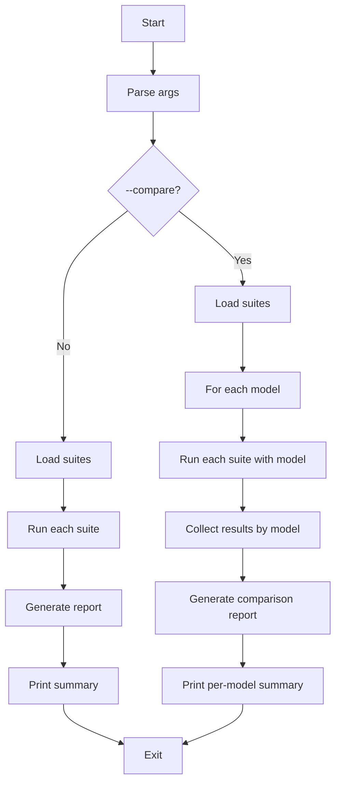

# Agent Evals

Run automated evaluation cases for AI agents with PASS/FAIL results and reports.

## Run

```bash
# Run a single suite
pnpm run:agent-evals -- --suite=example

# Run all suites
pnpm run:agent-evals -- --all

# With options
pnpm run:agent-evals -- --suite=example --verbose --report=both

# Compare models on one suite
pnpm run:agent-evals -- --suite=example --compare=gpt-5-mini,gpt-4.1-nano

# Compare across all suites
pnpm run:agent-evals -- --all --compare=gpt-5-mini,gpt-4.1-nano,gpt-4.1-mini --report=both
```

## Arguments

- `--suite <name>`: Run a specific suite by name (without `.json` extension)
- `--all`: Run all suites in the `suites/` directory
- `--report <format>`: Report format: `json`, `md`, or `both` (default: `json`)
- `--out <path>`: Output base directory under `tmp/` (default: `agent-evals`)
- `--verbose`: Enable verbose logging with per-assertion failure details
- `--compare <models>`: Comma-separated list of models to compare (at least 2). Supported: `gpt-5-mini`, `gpt-4.1-nano`, `gpt-4.1-mini`

Either `--suite` or `--all` is required.

## Output

Reports are written to `tmp/<out>/reports/` (default: `tmp/agent-evals/reports/`):

- `report-{timestamp}.json`: Machine-readable results
- `report-{timestamp}.md`: Human-readable markdown report

When `--compare` is used, reports are written to `tmp/<out>/comparison-reports/`:

- `comparison-{timestamp}.json`: Machine-readable comparison results
- `comparison-{timestamp}.md`: Side-by-side markdown comparison report

In comparison mode, `tmp/<out>/` is cleaned before each model run so tool side effects do not leak between models.

Exit code is 1 if any tests fail or error (single-model mode only).

## Creating Evaluation Suites

Add JSON files to `suites/` directory. Example structure:

```json
{
  "name": "my-suite",
  "description": "Test suite description",
  "version": "1.0.0",
  "agent": {
    "name": "MyTestAgent",
    "model": "gpt-5-mini",
    "instructions": "Agent system prompt here",
    "tools": [],
    "maxTurns": 3
  },
  "defaults": {
    "timeout": 15000
  },
  "cases": [
    {
      "id": "case-1",
      "name": "Test case name",
      "prompt": "User prompt to test",
      "assertions": [{ "type": "contains", "value": "expected text" }]
    }
  ]
}
```

### Suite Field Notes

- `agent.model` supports: `gpt-5-mini`, `gpt-4.1-nano`, `gpt-4.1-mini`. When using `--compare`, the suite's model is overridden for each comparison model.
- `agent.tools` accepts tool names from the registry: `readFile`, `writeFile`, `listFiles`, `deleteFile`.
- `agent.maxTurns` defaults to `5` if omitted.
- `defaults.timeout` applies per-case when the case does not provide `timeout`.
- `cases[].timeout` defaults to `defaults.timeout`, then `30000` (ms).
- `cases[].tags` is optional metadata for filtering/labeling (not used at runtime yet).

## Assertion Types

- **contains**: Check if output contains a string

  ```json
  { "type": "contains", "value": "text", "caseSensitive": false }
  ```

- **matchesRegex**: Check if output matches a regex pattern

  ```json
  { "type": "matchesRegex", "pattern": "\\d+", "flags": "i" }
  ```

- **equals**: Deep equality check

  ```json
  { "type": "equals", "expected": { "key": "value" } }
  ```

- **jsonPath**: Extract and compare nested values (dot notation like `response.status` or `$.response.status`)
  ```json
  { "type": "jsonPath", "path": "$.response.status", "expected": "success" }
  ```

### File Assertions (tmp/ only)

These assertions read files under `tmp/` to verify tool side effects. Paths are relative to `tmp/`.

- **fileExists**: Check that a file exists

  ```json
  { "type": "fileExists", "path": "agent-evals/tool-test-output.txt" }
  ```

- **fileContains**: Check that a file contains a string

  ```json
  {
    "type": "fileContains",
    "path": "agent-evals/tool-test-output.txt",
    "value": "Hello World",
    "caseSensitive": false
  }
  ```

- **fileJsonPath**: Read a JSON file and compare a path (dot notation like `$.name`)

  ```json
  {
    "type": "fileJsonPath",
    "path": "agent-evals/tool-test-data.json",
    "jsonPath": "$.name",
    "expected": "test"
  }
  ```

## Flowchart


