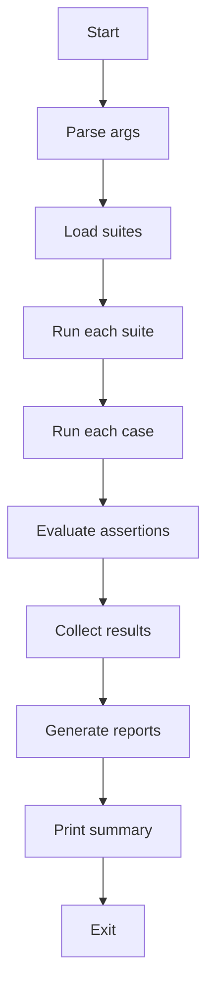

# Agent Evals

Run automated evaluation cases for AI agents with PASS/FAIL results and reports.

## Run

```bash
# Run a single suite
pnpm run:agent-evals -- --suite=example

# Run all suites
pnpm run:agent-evals -- --all

# With options
pnpm run:agent-evals -- --suite=example --verbose --report=both
```

## Arguments

- `--suite <name>`: Run a specific suite by name (without `.json` extension)
- `--all`: Run all suites in the `suites/` directory
- `--report <format>`: Report format: `json`, `md`, or `both` (default: `json`)
- `--out <path>`: Output directory under `tmp/` (default: `agent-evals`)
- `--verbose`: Enable verbose logging with assertion details

Either `--suite` or `--all` is required.

## Output

Reports are written to `tmp/agent-evals/`:
- `report-{timestamp}.json`: Machine-readable results
- `report-{timestamp}.md`: Human-readable markdown report

Exit code is 1 if any tests fail or error.

## Creating Evaluation Suites

Add JSON files to `suites/` directory. Example structure:

```json
{
  "name": "my-suite",
  "description": "Test suite description",
  "version": "1.0.0",
  "agent": {
    "name": "MyTestAgent",
    "model": "gpt-5-mini",
    "instructions": "Agent system prompt here",
    "tools": [],
    "maxTurns": 3
  },
  "defaults": {
    "timeout": 15000
  },
  "cases": [
    {
      "id": "case-1",
      "name": "Test case name",
      "prompt": "User prompt to test",
      "assertions": [
        { "type": "contains", "value": "expected text" }
      ]
    }
  ]
}
```

## Assertion Types

- **contains**: Check if output contains a string
  ```json
  { "type": "contains", "value": "text", "caseSensitive": false }
  ```

- **matchesRegex**: Check if output matches a regex pattern
  ```json
  { "type": "matchesRegex", "pattern": "\\d+", "flags": "i" }
  ```

- **equals**: Deep equality check
  ```json
  { "type": "equals", "expected": { "key": "value" } }
  ```

- **jsonPath**: Extract and compare nested values
  ```json
  { "type": "jsonPath", "path": "$.response.status", "expected": "success" }
  ```

## Flowchart


