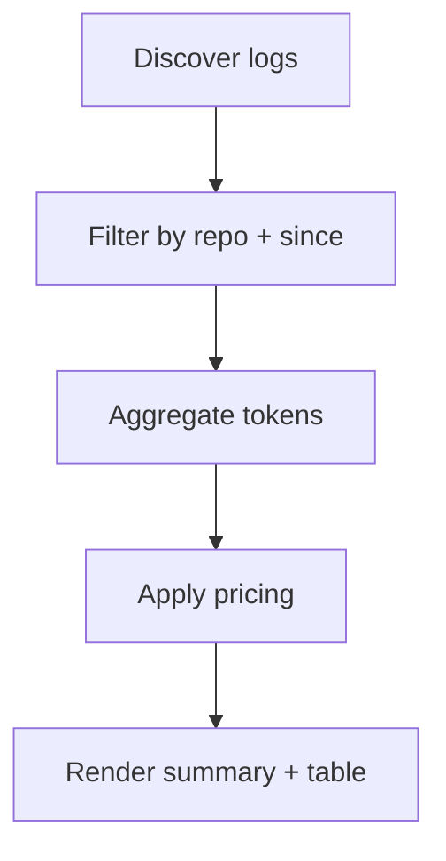

# AI Usage CLI

Summarize Claude and Codex token usage for a repo, including estimated costs from
`ai-usage.pricing.json`.

## Run

```bash
# Default: last 7 days for current git repo (or cwd if not in git)
pnpm ai:usage

# With options
pnpm ai:usage --since 24h
pnpm ai:usage --since 30d --repo /path/to/repo
pnpm ai:usage --json
pnpm ai:usage --debug
```

## Arguments

- `--since` (optional): time window to include. One of `1h`, `24h`, `7d`, `30d`.
- `--repo` (optional): path to repo to match against log cwd.
- `--json` (optional): emit JSON instead of the summary + table.
- `--debug` (optional): verbose logging about discovery and filtering.

## Log Sources

- **Claude:** `~/.claude/projects/<encoded-repo>/` JSONL logs
- **Codex:** `$CODEX_HOME/sessions` or `~/.codex/sessions` (YYYY/MM/DD folders)

Only entries whose `cwd` matches the repo path are counted.

## Output

- Summary by provider and by model.
- Markdown table with input/output/cache tokens, totals, and estimated cost.
- If a model is missing from `ai-usage.pricing.json`, cost is `0` and a warning is printed.

## Internals

- `UsagePipeline` owns repo resolution, log collection, aggregation, and formatting.
- `OutputFormatter` returns strings (summary/table/JSON); `main.ts` prints the report.

## Flow



## Example Result

```text
AI Usage Summary (Last 30d)

By Provider:
  claude: 216,462,575 tokens ($224.87)
  codex: 73,995,660 tokens ($82.01)

By Model:
  claude-opus-4-5-20251101: 216,462,575 tokens ($224.87)
  gpt-5.2-codex: 73,370,636 tokens ($81.89)
  gpt-5.1-codex-mini: 625,024 tokens ($0.12)

| Provider | Model                    |      Input |  Output |     Cache R |    Cache W |       Total | Est. Cost |
|----------|--------------------------|------------|---------|-------------|------------|-------------|-----------|
| claude   | claude-opus-4-5-20251101 |    267,949 |  47,358 | 204,118,277 | 12,028,991 | 216,462,575 |   $224.87 |
| codex    | gpt-5.2-codex            | 37,768,935 | 691,877 |  34,909,824 |          0 |  73,370,636 |    $81.89 |
| codex    | gpt-5.1-codex-mini       |    430,304 |   5,280 |     189,440 |          0 |     625,024 |     $0.12 |
|----------|--------------------------|------------|---------|-------------|------------|-------------|-----------|
| TOTAL    |                          | 38,467,188 | 744,515 | 239,217,541 | 12,028,991 | 290,458,235 |   $306.89 |
```
