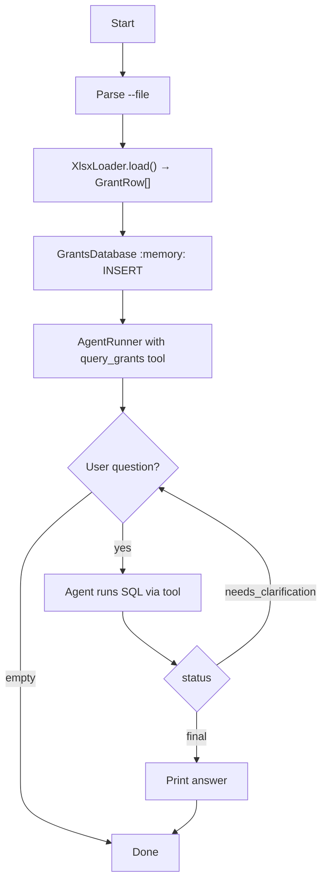

# Grants Explorer

Loads the Finnish grant-decisions workbook at `tmp/paatokset.xlsx` into an in-memory SQLite database and answers natural-language questions via an OpenAI agent that has a read-only `query_grants` SQL tool.

## Run

```
pnpm run:grants-explorer
pnpm run:grants-explorer --file=tmp/paatokset.xlsx
```

## Arguments

- `--file` (optional): path to the xlsx workbook. Defaults to `tmp/paatokset.xlsx`.

## Table schema

| Column               | Type    | Source header                |
| -------------------- | ------- | ---------------------------- |
| `decision_date`      | TEXT    | Päätös pvm (ISO date)        |
| `recipient`          | TEXT    | Saajan nimi (incl. y-tunnus) |
| `granting_authority` | TEXT    | Myöntäjä                     |
| `case_number`        | TEXT    | Asianumero                   |
| `amount_applied`     | INTEGER | Haettu (EUR, nullable)       |
| `amount_granted`     | INTEGER | Myönnetty (EUR, nullable)    |
| `has_eu_funding`     | INTEGER | EU-varat (0/1)               |
| `purpose`            | TEXT    | Hyväksytty käyttötarkoitus   |
| `programme`          | TEXT    | Haun nimi (asianumero)       |
| `region`             | TEXT    | Alueet                       |

`amount_applied` / `amount_granted` are nullable so an unknown amount stays distinguishable from a real `0 €` decision in aggregates.

## Example session

```
$ pnpm run:grants-explorer
Ask about Finnish grant decisions: How much has Lapin ELY-keskus granted in total?
[ANSWER] Lapin ELY-keskus has granted approximately X € across N decisions.
```

## Flowchart



## Notes

- `xlsx` (SheetJS) is used because the source workbook omits the optional cell `r` (reference) attribute and uses an unusual `x:` element-namespace prefix; `read-excel-file` and `exceljs` both rejected this layout in testing.
- `paatos_pvm` cells arrive as raw Excel serial numbers (date styling without the `t="d"` cell type), so the loader explicitly converts via `XLSX.SSF.parse_date_code`.
