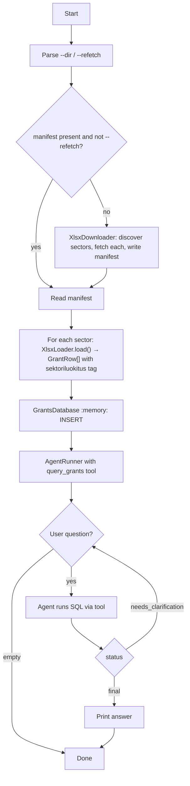

# Grants Explorer

Loads the Finnish grant-decisions workbook into an in-memory SQLite database and answers natural-language questions via an OpenAI agent that has a read-only `query_grants` SQL tool. The dataset spans every Sektoriluokitus (Finnish institutional sector classification) — one xlsx is fetched per sector and tagged at load.

## Run

```
pnpm run:grants-explorer
pnpm run:grants-explorer --dir=tmp/grants-explorer/paatokset
pnpm run:grants-explorer --refetch
```

## Arguments

- `--dir` (optional): path to the per-sector xlsx directory. Defaults to `tmp/grants-explorer/paatokset`.
- `--refetch` (optional, presence-only flag): re-fetch from [tutkihallintoa.fi](https://www.tutkihallintoa.fi/valtionavustukset/tutkiavustuksia/) before loading. The fetch is resume-friendly: any per-sector `<code>.xlsx` already on disk and parseable is skipped, so re-running after a mid-loop failure only fetches the missing sectors. Pass it bare (`--refetch`) to enable; omit to load from cache. Any explicit value (`--refetch=false`, `--refetch=true`, …) is rejected by the schema. To force a full re-download, delete the directory: `rm -rf tmp/grants-explorer/paatokset && pnpm run:grants-explorer --refetch`.

Without `--refetch`, the CLI auto-fetches only when the `sectors.json` manifest is missing.

## Cache layout

```
tmp/grants-explorer/
├── grants.json         # combined dataset: a single JSON array of every GrantRow
└── paatokset/
    ├── sectors.json    # manifest: [{ code: "S11", label: "Yritykset" }, …]
    ├── S11.xlsx
    ├── S12.xlsx
    ├── …
    └── S15.xlsx
```

The manifest is written **only after every sector finishes downloading**. A missing manifest therefore signals an incomplete cache, regardless of how many `<code>.xlsx` files are present.

`grants.json` is rewritten after every successful load (atomic temp + rename). It mirrors the in-memory dataset 1:1 with snake_case field names and is the recommended artifact for downstream tools (jq, duckdb, pandas). The per-sector `<code>.xlsx` files stay alongside because the downloader uses them for resume-after-failure semantics — `grants.json` is a derived artifact, not a replacement cache.

## Source data

xlsx files are downloaded from the Tutkiavustuksia.fi Power BI report, tab **Avustusasiat**, **"Myönteiset päätökset"** (positive grant decisions) table. The Sektoriluokitus slicer is iterated through every option discovered live in the report — including the `(Tyhjä)` and `Sektoriluokitus puuttuu` buckets — so the per-sector exports form a complete partition of all positive decisions. After download, the loader reconciles the summed row count against the report's "Myönteiset avustuspäätökset" headline and warns on a shortfall. Each value is exported separately because Power BI caps a single export at 150 000 rows.

Note: this is the _decisions_ view, not "Saapuneet hakemukset" (received applications, a larger superset that includes rejected/pending requests).

Other filter scopes (date ranges, other tabs) are intentionally not exposed as CLI flags — broadening the scope would change which grants land in the SQL DB and invalidate any saved analyses. Filter per-query in SQL after load instead.

## Table schema

| Column                  | Type    | Source header                                        |
| ----------------------- | ------- | ---------------------------------------------------- |
| `decision_date`         | TEXT    | Päätös pvm (ISO date)                                |
| `recipient`             | TEXT    | Saajan nimi (full original string, incl. y-tunnus)   |
| `recipient_business_id` | TEXT    | Y-tunnus extracted from Saajan nimi (indexed)        |
| `granting_authority`    | TEXT    | Myöntäjä                                             |
| `case_number`           | TEXT    | Asianumero                                           |
| `amount_applied`        | INTEGER | Haettu (EUR, nullable)                               |
| `amount_granted`        | INTEGER | Myönnetty (EUR, nullable)                            |
| `has_eu_funding`        | INTEGER | EU-varat (0/1)                                       |
| `purpose`               | TEXT    | Hyväksytty käyttötarkoitus                           |
| `programme`             | TEXT    | Haun nimi (asianumero)                               |
| `region`                | TEXT    | Alueet                                               |
| `sektoriluokitus_code`  | TEXT    | Sektoriluokitus code (e.g. `S15`), NOT NULL, indexed |
| `sektoriluokitus_label` | TEXT    | Sektoriluokitus human label, NOT NULL                |

`amount_applied` / `amount_granted` are nullable so an unknown amount stays distinguishable from a real `0 €` decision in aggregates.

`recipient_business_id` is `NULL` for recipients that don't have a Finnish Business ID — private persons, foreign entities, and ad-hoc working groups. The loader logs the count of such rows under `recipientsWithoutBusinessId`. Use `recipient_business_id = '<y-tunnus>'` for indexed equality lookups and `GROUP BY recipient_business_id` to aggregate per legal entity.

`sektoriluokitus_code` and `sektoriluokitus_label` originate from the manifest, not the xlsx itself — every row of `<code>.xlsx` is tagged with the matching manifest entry at load time. Codes are `S` + 1–6 digits (coarse like `S11` and deep like `S131311` coexist, since the source classifies at varying precision). Two sentinel codes cover the sector-less rows: `BLANK` (slicer `(Tyhjä)`, a null value) and `PUUTTUU` (the source's explicit `Sektoriluokitus puuttuu`). To reproduce the legacy NPISH-only view, filter `WHERE sektoriluokitus_code = 'S15'`; for classified-only analysis use `WHERE sektoriluokitus_code LIKE 'S%'`.

## Example session

```
$ pnpm run:grants-explorer
Ask about Finnish grant decisions: How much has Lapin ELY-keskus granted in total across all sectors?
[ANSWER] Lapin ELY-keskus has granted approximately X € across N decisions.
```

## Flowchart



## Notes

- `xlsx` (SheetJS) is used because the source workbook omits the optional cell `r` (reference) attribute and uses an unusual `x:` element-namespace prefix; `read-excel-file` and `exceljs` both rejected this layout in testing.
- `paatos_pvm` cells arrive as raw Excel serial numbers (date styling without the `t="d"` cell type), so the loader explicitly converts via `XLSX.SSF.parse_date_code`.
- The Sektoriluokitus slicer is virtualized. To enumerate every option the downloader opens the dropdown and walks the listbox via keyboard `ArrowDown`, reading the focused option's text each step. Power BI auto-scrolls the focused row into view, which is more robust than guessing a scroll-container CSS class. A `MIN_EXPECTED_SECTORS` guard aborts the run with a debug screenshot if discovery returns fewer sectors than expected, and the post-download headline reconciliation catches a partial miss that still clears the guard.
- Selecting a filter: real S-codes use search-then-click (type the code into "Hae", click the row whose text starts with `"<code> "`; the trailing space stops `S1313` from also matching `S131311`). The two sentinel buckets `(Tyhjä)` and `Sektoriluokitus puuttuu` use keyboard-nav selection — ArrowDown until `document.activeElement.innerText` equals the target label, then click the focused row. Playwright's substring text locators (`getByText("(Tyhjä)")`) proved unreliable here: the row's whole-element text doesn't normalize to the bare label.
- The slicer dropdown is always closed via `Escape` in a `try/finally` around the selection block. If selection throws and the dropdown stays open, the next sector's `dropdown.click()` would toggle it shut instead of opening it — and the subsequent 'Hae' visibility check would fail, aborting the whole run.
- The slicer is assumed to be single-select; clicking sector S12 after S11 deselects S11 automatically. The per-sector zero-rows assertion in `downloadOneSector` will surface a regression to multi-select (every export after the first would be empty).
