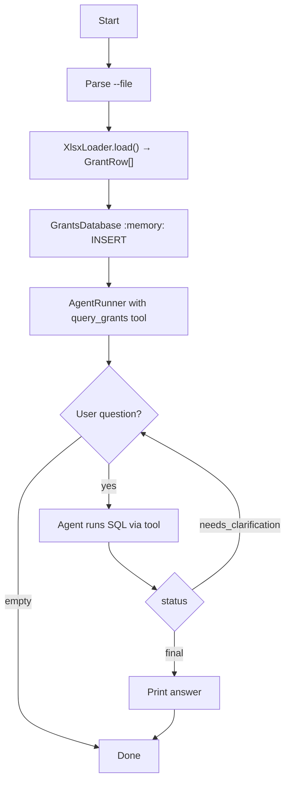

# Grants Explorer

Loads the Finnish grant-decisions workbook at `tmp/paatokset.xlsx` into an in-memory SQLite database and answers natural-language questions via an OpenAI agent that has a read-only `query_grants` SQL tool.

## Run

```
pnpm run:grants-explorer
pnpm run:grants-explorer --file=tmp/paatokset.xlsx
pnpm run:grants-explorer --refetch
```

## Arguments

- `--file` (optional): path to the xlsx workbook. Defaults to `tmp/paatokset.xlsx`.
- `--refetch` (optional, presence-only flag): force-download the latest xlsx from [tutkihallintoa.fi](https://www.tutkihallintoa.fi/valtionavustukset/tutkiavustuksia/) before loading. Without the flag, the CLI uses the local file if present and auto-downloads only when it's missing. Pass it bare (`--refetch`) to enable; omit it to disable. Any explicit value (`--refetch=false`, `--refetch=true`, …) is rejected by the schema.

## Source data

`paatokset.xlsx` is downloaded from the Tutkiavustuksia.fi Power BI report, pre-filtered to:

- Tab: **Avustusasiat**
- Slicer: **Sektoriluokitus = S15 Kotitalouksia palvelevat voittoa tavoittelemattomat järjestöt** (Non-profit institutions serving households)

Other filter scopes (date ranges, other sectors, other tabs) are intentionally not exposed as CLI flags — broadening the scope would change which grants land in the SQL DB and invalidate any saved analyses. Filter per-query in SQL after load instead.

## Table schema

| Column                  | Type    | Source header                                      |
| ----------------------- | ------- | -------------------------------------------------- |
| `decision_date`         | TEXT    | Päätös pvm (ISO date)                              |
| `recipient`             | TEXT    | Saajan nimi (full original string, incl. y-tunnus) |
| `recipient_business_id` | TEXT    | Y-tunnus extracted from Saajan nimi (indexed)      |
| `granting_authority`    | TEXT    | Myöntäjä                                           |
| `case_number`           | TEXT    | Asianumero                                         |
| `amount_applied`        | INTEGER | Haettu (EUR, nullable)                             |
| `amount_granted`        | INTEGER | Myönnetty (EUR, nullable)                          |
| `has_eu_funding`        | INTEGER | EU-varat (0/1)                                     |
| `purpose`               | TEXT    | Hyväksytty käyttötarkoitus                         |
| `programme`             | TEXT    | Haun nimi (asianumero)                             |
| `region`                | TEXT    | Alueet                                             |

`amount_applied` / `amount_granted` are nullable so an unknown amount stays distinguishable from a real `0 €` decision in aggregates.

`recipient_business_id` is `NULL` for recipients that don't have a Finnish Business ID — private persons, foreign entities, and ad-hoc working groups. The loader logs the count of such rows under `recipientsWithoutBusinessId`. Use `recipient_business_id = '<y-tunnus>'` for indexed equality lookups and `GROUP BY recipient_business_id` to aggregate per legal entity.

## Example session

```
$ pnpm run:grants-explorer
Ask about Finnish grant decisions: How much has Lapin ELY-keskus granted in total?
[ANSWER] Lapin ELY-keskus has granted approximately X € across N decisions.
```

## Flowchart



## Notes

- `xlsx` (SheetJS) is used because the source workbook omits the optional cell `r` (reference) attribute and uses an unusual `x:` element-namespace prefix; `read-excel-file` and `exceljs` both rejected this layout in testing.
- `paatos_pvm` cells arrive as raw Excel serial numbers (date styling without the `t="d"` cell type), so the loader explicitly converts via `XLSX.SSF.parse_date_code`.
