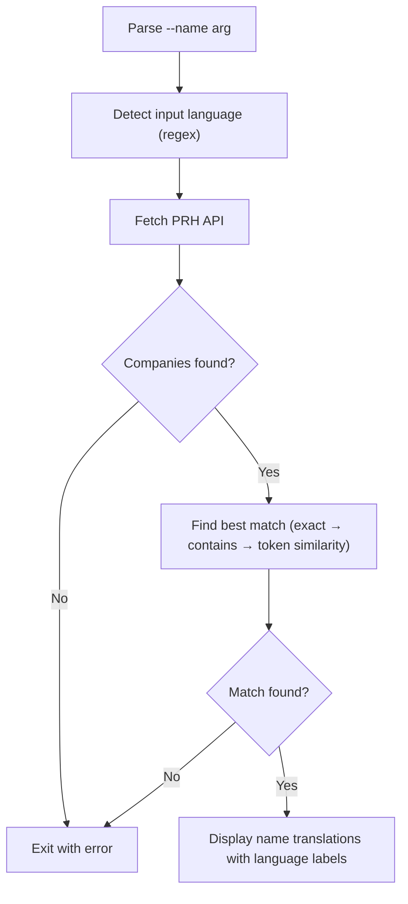

# Owner Lookup

Look up Finnish company name translations from PRH (Patent and Registration Office) by shareholder/company name.

## Run

```
pnpm run:owner-lookup -- --name="Skandinaviska Enskilda Banken Ab (publ) Helsingin Sivukonttori"
```

## Arguments

- `--name` (required): The shareholder or company name to look up.

## Output

Displays the matched company's name translations (Finnish, Swedish, English) with detected language labels and the business ID.

## Flowchart



## Data Source

- PRH Open Data API: `https://avoindata.prh.fi/opendata-ytj-api/v3/companies?name=...`
