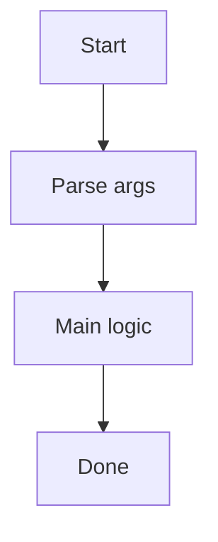

# Prh Companies

Download PRH company registry and extract company names

## Run

```
pnpm run:prh-companies
```

## Arguments

- `--verbose` (optional): Enable verbose logging.

## Output

Writes under `tmp/prh-companies/`.

## Flowchart



## Notes

- Replace `Prh Companies` and `Download PRH company registry and extract company names` with the real CLI name and summary.
- Update the arguments/output sections to match the CLI behavior.
