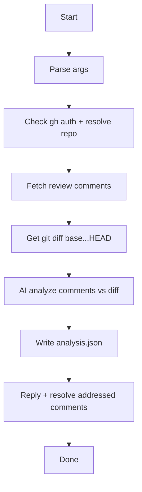

# Resolve PR Comments CLI

Analyze review comments on a GitHub PR against the current diff, then reply to addressed or uncertain comments and resolve those marked addressed.

## Run

```bash
pnpm run:resolve-pr-comments -- --pr=10
pnpm run:resolve-pr-comments -- --pr=10 --repo=owner/repo
pnpm run:resolve-pr-comments -- --pr=10 --base=main
pnpm run:resolve-pr-comments -- --pr=10 --dry-run
```

## Arguments

- `--pr` (required): PR number to analyze.
- `--repo` (optional): Repository in `owner/repo` format. Defaults to `gh repo view`.
- `--base` (default: `main`): Base ref for `git diff <base>...HEAD`.
- `--dry-run` (default: false): Log replies/resolutions without posting.

## Workflow

1. Ensures `gh` is installed and authenticated
2. Resolves repo (`--repo` override or `gh repo view`)
3. Fetches inline review comments for the PR
4. Gets the git diff for `base...HEAD`
5. Analyzes comments vs diff with a single AI request
6. Writes analysis JSON under `tmp/resolve-pr-comments/pr-<number>/`
7. Replies to addressed or uncertain comments and resolves addressed ones (skipped in dry-run)

## Output

Writes analysis to:

```
tmp/resolve-pr-comments/pr-<number>/analysis.json
```

## Prerequisites

- `gh` CLI installed and authenticated (`gh auth login`)
- `OPENAI_API_KEY` set for the analysis model
- Local git checkout with the base ref available (e.g., `main`)

## Flowchart



## Internals

- `ResolvePrPipeline` orchestrates GitHub fetch, diff capture, analysis, and resolution
- `CommentAnalyzer` uses `AgentRunner` to classify comments as addressed or not
- `CommentResolver` posts replies and resolves threads via `GitHubClient`
