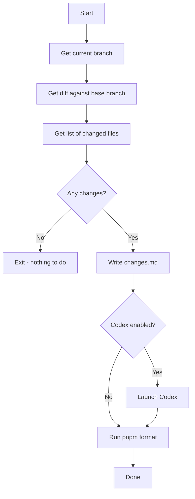

# Update Docs

Update documentation based on branch changes. Compares the current branch against a base branch (default: `main`), generates a diff, and uses Codex to automatically update relevant documentation.

## Run

```
pnpm run:update-docs
```

## Arguments

- `--base <branch>` (optional): Base branch to compare against. Defaults to `main`.
- `--codex` / `--no-codex` (optional): Enable or disable Codex auto-update. Defaults to `true`.

## Examples

```bash
# Compare against main and auto-update docs
pnpm run:update-docs

# Compare against a different base branch
pnpm run:update-docs --base=develop

# Generate diff without running Codex
pnpm run:update-docs --no-codex
```

## Output

Writes changes summary to `tmp/update-docs/changes.md`.

## Flowchart



## Documentation Targets

When Codex runs, it updates:

1. `README.md` - If new features, changed usage, or new dependencies
2. `CLAUDE.md/AGENTS.md` - If new patterns, conventions, or tools added
3. `src/cli/*/README.md` - CLI-specific docs for changed CLIs
4. Inline JSDoc comments - For changed/new functions
