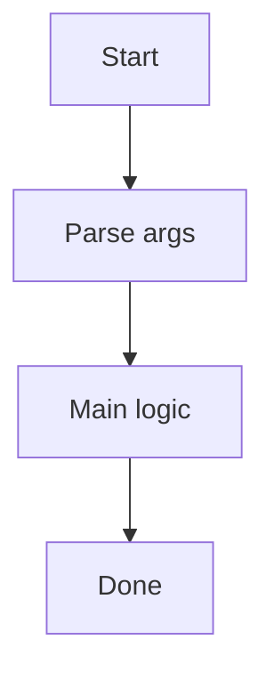

# _CLI_TITLE_

_CLI_DESCRIPTION_

## Run

```
pnpm run:_CLI_NAME_
```

## Arguments

- `--verbose` (optional): Enable verbose logging.

## Output

Writes under `tmp/_CLI_NAME_/`.

## Flowchart



## Notes

- See `CHECKLIST.md` for post-scaffold setup tasks.
