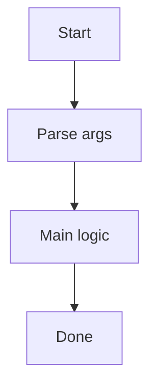

# **__CLI_NAME_TITLE__** CLI

**__CLI_DESCRIPTION__**

## Run

```
pnpm run:__CLI_NAME__
```

## Arguments

- `--verbose` (optional): Enable verbose logging.

## Output

Writes under `tmp/__CLI_NAME__/`.

## Flowchart



## Notes

- See `CHECKLIST.md` for post-scaffold setup tasks.
